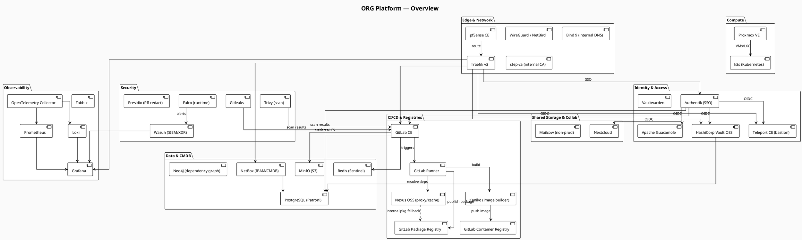
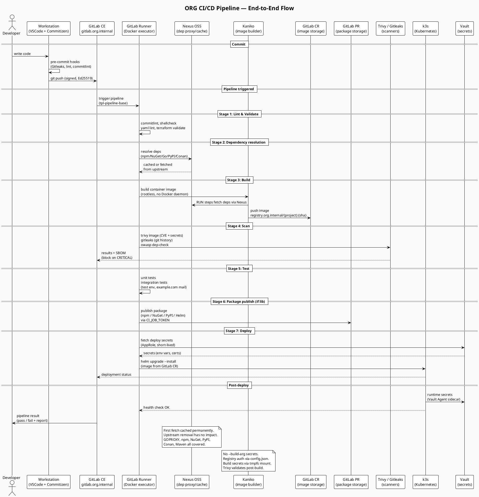
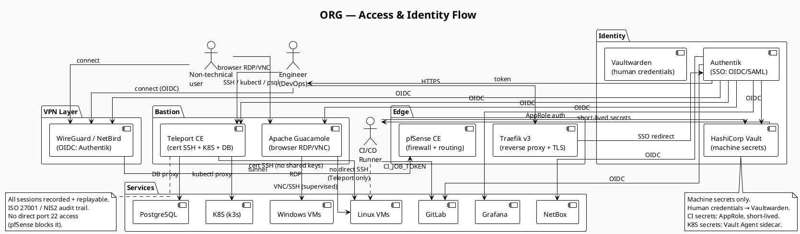
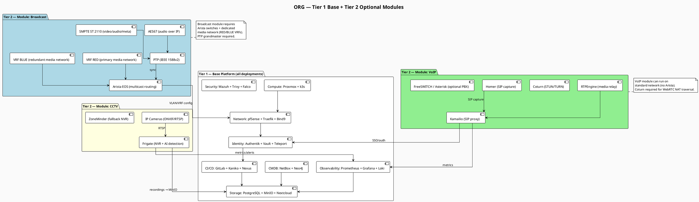

# ORG Platform — Architecture

**Last updated:** 2026-03-25
**Status:** Draft — PoC phase
**Related docs:** `docs/stack.md`, `docs/naming-convention.md`, `docs/adr/0001-platform-stack-decisions.md`

> Diagrams are written in PlantUML. Rendered via KROKI (`kroki.org.internal`).
> Source files: `assets/diagrams/` — exports: `assets/exports/`

---

## 1. Platform Overview

High-level view of all platform layers and their relationships.

---

## 2. Network Topology

Logical network segmentation — VLANs, zones, and traffic flows.

```plantuml
@startuml network-topology
!theme plain
skinparam backgroundColor #FAFAFA
skinparam defaultFontName monospace
skinparam linetype ortho

title ORG Network — Logical Topology

cloud "Internet / ISP" as internet

package "DMZ (VLAN 10)" {
  [Traefik v3\nedge.org.example] as traefik_dmz
  [Cloudflare DNS\norg.example] as cf
}

package "Management (VLAN 20)" {
  [pfSense CE\nfw-pfsense-prod-01] as pfsense
  [Bind 9\ndns.org.internal] as dns
  [step-ca\nca.org.internal] as ca
  [Proxmox VE\nsrv-proxmox-prod-01] as proxmox
}

package "Platform (VLAN 30)" {
  [GitLab CE\ngitlab.org.internal] as gitlab
  [Vault\nvault.org.internal] as vault
  [Authentik\nauth.org.internal] as authentik
  [NetBox\nnetbox.org.internal] as netbox
  [Nexus OSS\nnexus.org.internal] as nexus
  [Teleport CE\nbastion.org.internal] as teleport
}

package "Observability (VLAN 40)" {
  [Prometheus\nprometheus.org.internal] as prom
  [Grafana\ngrafana.org.internal] as grafana
  [Loki\nloki.org.internal] as loki
  [Wazuh\nwazuh.org.internal] as wazuh
}

package "Workloads / K8S (VLAN 50)" {
  [k3s cluster\n*.svc.cluster.local] as k3s
}

package "Storage (VLAN 60)" {
  [PostgreSQL\npg.org.internal] as pg
  [MinIO\nminio.org.internal] as minio
  [Nextcloud\ncloud.org.internal] as nextcloud
}

package "User devices (VLAN 99)" {
  [Workstations\n(VPN: NetBird/WireGuard)] as ws
}

' Internet flows
internet --> cf : DNS
internet --> pfsense : WAN
pfsense --> traefik_dmz : HTTPS 443

' Internal routing
traefik_dmz --> platform : route *.org.internal
pfsense --> management : admin
ws --> pfsense : VPN tunnel
ws --> teleport : SSH/K8S/DB (bastion)

' Platform to data
gitlab --> pg
vault --> pg
authentik --> pg
netbox --> pg
gitlab --> minio

' DNS
dns --> pfsense : upstream
pfsense ..> dns : split DNS

' Firewall rules (dashed = restricted)
pfsense ..> platform : filtered
pfsense ..> observability : filtered
pfsense ..> workloads : filtered

note bottom of ws
  No direct SSH to VMs.
  All access via Teleport bastion
  or Guacamole (Windows RDP/VNC).
end note

note right of nexus
  GOPROXY, npm, NuGet,
  PyPI, Conan, Maven.
  Cache-first — no direct
  internet from CI builds.
end note

@enduml
```

---

## 3. CI/CD Pipeline Flow

End-to-end flow from git push to deployed service.

---

## 4. Access & Identity Flow

How authentication and access control flows from user to service.

---

## 5. Module Architecture (Tier 2)

Optional modules layered on top of the base platform.

---

## Diagram source files

| Diagram | Source | Export |
|---|---|---|
| Platform overview | `assets/diagrams/arch-platform-overview-v1.puml` | `assets/exports/arch-platform-overview-v1.png` |
| Network topology | `assets/diagrams/arch-network-topology-v1.puml` | `assets/exports/arch-network-topology-v1.png` |
| CI/CD pipeline | `assets/diagrams/arch-cicd-pipeline-v1.puml` | `assets/exports/arch-cicd-pipeline-v1.png` |
| Access & identity | `assets/diagrams/arch-access-identity-v1.puml` | `assets/exports/arch-access-identity-v1.png` |
| Module architecture | `assets/diagrams/arch-module-tiers-v1.puml` | `assets/exports/arch-module-tiers-v1.png` |

> To render locally: install KROKI CLI or use `kroki.org.internal`.
> To export PNG: `kroki convert assets/diagrams/arch-*.puml --format png --output assets/exports/`
